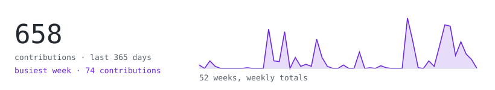
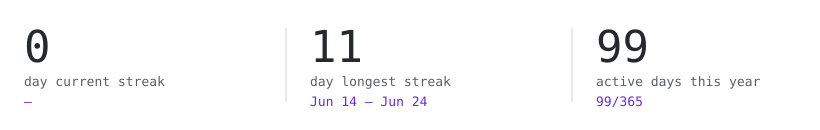
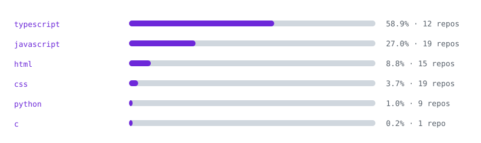
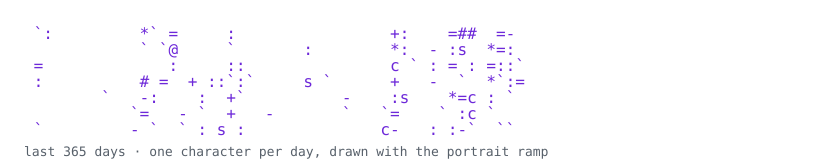

<!-- Everything on this page is generated inside this repo. No third-party
     stat cards, no external requests. See scripts/ and the workflow. -->

  <picture>
    <source media="(prefers-color-scheme: dark)" srcset="svg/portrait-dark.svg">
    
  </picture>

<samp>lakota fox &middot; <a href="https://lakotafox.com">lakotafox.com</a></samp>

> AI certified by IBM and Google. Python, JavaScript, HTML/CSS, and Linux — 
> prompt engineering, LLM integration, AI agents, and multi-agent swarms. 
> Claude Code power user.

<picture>
  <source media="(prefers-color-scheme: dark)" srcset="svg/hd-stats-dark.svg">
  
</picture>

<picture>
  <source media="(prefers-color-scheme: dark)" srcset="svg/stats-dark.svg">
  
</picture>

<picture>
  <source media="(prefers-color-scheme: dark)" srcset="svg/streak-dark.svg">
  
</picture>

<picture>
  <source media="(prefers-color-scheme: dark)" srcset="svg/langs-dark.svg">
  
</picture>

<picture>
  <source media="(prefers-color-scheme: dark)" srcset="svg/year-dark.svg">
  
</picture>

drawn nightly by this repo's own <a href=".github/workflows/refresh-stats.yml">workflow</a> — if a card ever breaks, it's my fault and nobody else's

  

<picture>
  <source media="(prefers-color-scheme: dark)" srcset="svg/hd-projects-dark.svg">
  
</picture>

<samp><a href="https://lakotafox.com/plant-id/">plant identifier</a> — point a camera at a plant, get a species &middot; in-browser AI, no server</samp> 
<samp><a href="https://lakotafox.com/bird-id/">bird song id</a> — identifies birds from a live microphone &middot; transformers.js</samp> 
<samp><a href="https://lakotafox.com/lidar/">3d scanner</a> — photo &rarr; AI depth &rarr; 3D point cloud &rarr; .PLY export &middot; webgpu</samp> 
<samp><a href="https://foxbuiltstore.com">foxbuilt office furniture</a> — real store, real customers &middot; react</samp> 
<samp><a href="https://adventurecrafter.netlify.app">adventurecrafter</a> — custom 2D game engine, real-time multiplayer world building</samp> 
<samp><a href="https://lakotafox.com">lakotafox.com</a> — the rest: games, maps, art, client sites &middot; react + vite</samp>

<picture>
  <source media="(prefers-color-scheme: dark)" srcset="svg/hd-certs-dark.svg">
  
</picture>

<samp>google ai essentials &middot; ibm ai developer professional certificate</samp>

 
